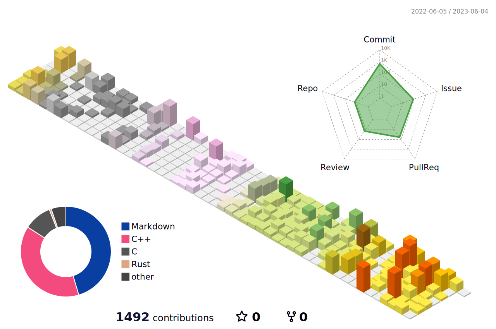

[](https://www.linkedin.com/in/tylerswann05/)
<!--  -->

<!--  -->

Hi, my name is Tyler Swann (aka oraqlle).

- 🏗️ I’m currently working on 
  - [Pong](https://github.com/oraqlle/pong)
  - [The Cortex Library](https://github.com/oraqlle/cortexlib)
  - [Lix Programming Language](https://github.com/oraqlle/lix)
- 📚 I've built 
  - [A Lispy Intepreter](https://github.com/oraqlle/lispy)
  - [Crank - A State Management Framework](https://github.com/oraqlle/crank)
  - [SV - A sorting Algorithm Visualizer using SFML](https://github.com/oraqlle/sorting-visualizer)
  - [CodeBytes - Blog and project portfolio](https://github.com/oraqlle/codebytes)
- 🏫 I'm currently a second year Software Engineering and Computer Science student at Monash University.
- 🌱 I’m currently learning the C++ (always), Rust, Elixir, BQN programming languages.
- 🤔 I am interested in programming language design, compilers and developer tooling.
- 📕 I'm currently reading Programming Rust 2nd Edition and Category Theory for Programmers.
- ✏️ Blog website [CodeBytes](https://codebytes.netlify.app)
- 📫 How to reach me: tyler.swann05@gmail.com


## 🛠️ Languages and Tools :

<p>
  <!-- C++ -->
  &nbsp;
  <!-- Rust -->
  &nbsp;
  <!-- Haskell -->
  &nbsp;
  <!-- VSCode -->
  &nbsp;
  <!-- C -->
  &nbsp;
  <!-- Bash -->
  &nbsp;
  <!-- Python -->
  &nbsp;
  <!-- Julia -->
  &nbsp;
  <!-- Elixir -->
  &nbsp;
  <!-- GCC -->
  &nbsp;
  <!-- Git -->
  &nbsp;
  <!-- Linux -->
  &nbsp;
</p>


## ⚡Statistics :


<details>
  <summary> ⚙️ Projects </summary>
  <br/>
  
  [](https://github.com/oraqlle/cortexlib)

  [](https://github.com/oraqlle/crank)

  [](https://github.com/oraqlle/sorting-visualizer)

  [](https://github.com/oraqlle/codebytes)

  <!-- [](https://github.com/oraqlle/lix) -->
</details>
  
<details>
  <summary> 🕗 WakaTime </summary>
  </br>
  Total time coded since March 21 2023
  </br> 
  
  </br></br>

  <!--START_SECTION:waka-->
**I'm an Early 🐤** 

```text
🌞 Morning                1204 commits        ⣿⣿⣿⣿⣿⣿⣀⣀⣀⣀⣀⣀⣀⣀⣀⣀⣀⣀⣀⣀⣀⣀⣀⣀⣀   22.35 % 
🌆 Daytime                2318 commits        ⣿⣿⣿⣿⣿⣿⣿⣿⣿⣿⣿⣀⣀⣀⣀⣀⣀⣀⣀⣀⣀⣀⣀⣀⣀   43.03 % 
🌃 Evening                1364 commits        ⣿⣿⣿⣿⣿⣿⣀⣀⣀⣀⣀⣀⣀⣀⣀⣀⣀⣀⣀⣀⣀⣀⣀⣀⣀   25.32 % 
🌙 Night                  501 commits         ⣿⣿⣀⣀⣀⣀⣀⣀⣀⣀⣀⣀⣀⣀⣀⣀⣀⣀⣀⣀⣀⣀⣀⣀⣀   09.30 % 
```
📅 **I'm Most Productive on Wednesday** 

```text
Monday                   839 commits         ⣿⣿⣿⣿⣀⣀⣀⣀⣀⣀⣀⣀⣀⣀⣀⣀⣀⣀⣀⣀⣀⣀⣀⣀⣀   15.57 % 
Tuesday                  764 commits         ⣿⣿⣿⣿⣀⣀⣀⣀⣀⣀⣀⣀⣀⣀⣀⣀⣀⣀⣀⣀⣀⣀⣀⣀⣀   14.18 % 
Wednesday                918 commits         ⣿⣿⣿⣿⣀⣀⣀⣀⣀⣀⣀⣀⣀⣀⣀⣀⣀⣀⣀⣀⣀⣀⣀⣀⣀   17.04 % 
Thursday                 760 commits         ⣿⣿⣿⣿⣀⣀⣀⣀⣀⣀⣀⣀⣀⣀⣀⣀⣀⣀⣀⣀⣀⣀⣀⣀⣀   14.11 % 
Friday                   678 commits         ⣿⣿⣿⣀⣀⣀⣀⣀⣀⣀⣀⣀⣀⣀⣀⣀⣀⣀⣀⣀⣀⣀⣀⣀⣀   12.59 % 
Saturday                 554 commits         ⣿⣿⣿⣀⣀⣀⣀⣀⣀⣀⣀⣀⣀⣀⣀⣀⣀⣀⣀⣀⣀⣀⣀⣀⣀   10.28 % 
Sunday                   874 commits         ⣿⣿⣿⣿⣀⣀⣀⣀⣀⣀⣀⣀⣀⣀⣀⣀⣀⣀⣀⣀⣀⣀⣀⣀⣀   16.22 % 
```


📊 **This Week I Spent My Time On** 

```text
💬 Programming Languages: 
Python                   13 hrs 41 mins      ⣿⣿⣿⣿⣿⣿⣿⣿⣿⣿⣿⣿⣿⣿⣿⣿⣿⣿⣿⣿⣀⣀⣀⣀⣀   78.57 % 
Other                    1 hr 45 mins        ⣿⣿⣿⣀⣀⣀⣀⣀⣀⣀⣀⣀⣀⣀⣀⣀⣀⣀⣀⣀⣀⣀⣀⣀⣀   10.14 % 
Text                     43 mins             ⣿⣀⣀⣀⣀⣀⣀⣀⣀⣀⣀⣀⣀⣀⣀⣀⣀⣀⣀⣀⣀⣀⣀⣀⣀   04.15 % 
C++                      32 mins             ⣿⣀⣀⣀⣀⣀⣀⣀⣀⣀⣀⣀⣀⣀⣀⣀⣀⣀⣀⣀⣀⣀⣀⣀⣀   03.11 % 
Markdown                 20 mins             ⣀⣀⣀⣀⣀⣀⣀⣀⣀⣀⣀⣀⣀⣀⣀⣀⣀⣀⣀⣀⣀⣀⣀⣀⣀   01.94 % 

💻 Operating System: 
WSL                      17 hrs 25 mins      ⣿⣿⣿⣿⣿⣿⣿⣿⣿⣿⣿⣿⣿⣿⣿⣿⣿⣿⣿⣿⣿⣿⣿⣿⣿   100.00 % 
```


<!--END_SECTION:waka-->

</details>

<details>
   <summary> 🦾 Profile 3D  Contribution Graphic </summary>
   <br/>
   
</details>
